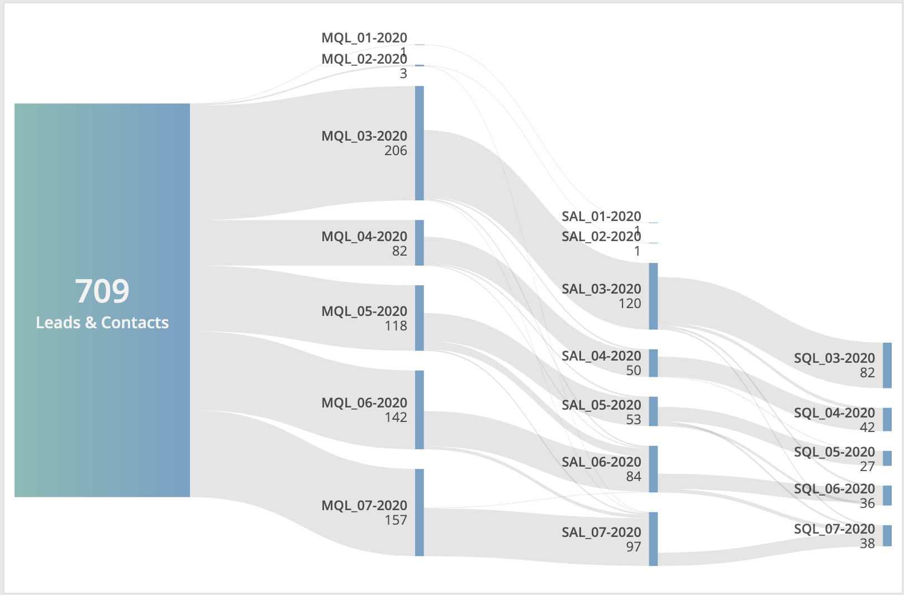

# datorama-d3-sankey
Custom widget for Datorama. Creates a Sankey Flow Diagram.

This custom widget transforms supplied data and creates a Sankey Flow Diagram. The input is multiple dimensions linked together by one measurement.

This assumes your measurement is summable, and provides preference functions to let you set the number formatting.



## Preferences
Add this code to the JS section of the Custom Widget Editor.

The top part controls locale (decimals, thousands, currency, etc.), while the `num` and `pct` functions control things like how many decimals to include, whether it's currency or percent, etc.. Commas, dots, currency symbols and the like in the format specifiers must be given in US format. There are some instructions in the comments, but for a more thorough documentation, visit [d3-format](https://github.com/d3/d3-format) and [play with an ineractive inerpreter to test quickly](http://bl.ocks.org/zanarmstrong/05c1e95bf7aa16c4768e).

The last part controls how removal of nodes and links works, so that variable-length journeys can be shown. You may prefer to show ended journeys in the visualisation by linking back to a node labelled as such, or you may just prefer to remove the node, link, and label altogether. If you prefer the latter, add the names to be removed to this array - for example, `['', '(not set)']` would remove blanks and "(not set)".
```
// Number locale preferences
  d3.formatDefaultLocale({
    'decimal': '.', // the decimal point (e.g., ".")
    'thousands': ',', // the group separator (e.g., ",")
    'grouping': [3], // the array of group sizes (e.g., [3]), cycled as needed
    'currency': ['$', ''], // the currency prefix and suffix (e.g., ["$", ""])
    'numerals': ['0', '1', '2', '3', '4', '5', '6', '7', '8', '9'], // an array of ten strings to replace the numerals 0-9
    'percent': '%', // the percent sign
    'minus': '-', // the minus sign
    'nan': 'NaN' // the not-a-number value
  });

// Format for numbers
  // add $ before the format string for local currency (must be dollar sign)
  // the number controls the decimals
  // remove the comma if you don't want thousands separation
  function num(value) {
    return d3.format(',.0f')(value);
  }

// Format for percentages
  // the number controls the decimals
  function pct(value) {
    return d3.format('.0%')(value);
  }

// Don't display these values
  // Store as comma-separated list of strings, e.g. ['']
  var nullValues = [];
```

## Common Style Changes
### Change the colour of the nodes
To change the colour of the nodes, add this to the CSS section of the Custom Widget Editor. To look ideal, `grad-end` in the gradient should have the same colour as `.node`.
```
#gradient {
  --grad-start: rgb(134, 188, 182);
  --grad-end: rgb(117, 161, 199);
}

.node {
  fill: rgb(117, 161, 199);
}
```

### Arrange labels and numbers horizontally
To show labels and numbers on a row, instead of stacked in a column, add this to the CSS section of the Custom Widget Editor.
```
.labelContainer {
  flex-direction: row;
  justify-content: flex-end;
  align-items: center;
}

.labelContainer .values {
  padding-left: 1ch;
}
```

## Set up and Dependencies
Add `sankey.initialize(num, pct);` to the JS section of the Custom Widget Editor, and add the below links to the dependencies area (second button at the top left of the Custom Widget Editor).

Script dependencies (must be loaded in this order):
1. `https://d3js.org/d3.v5.min.js`
2. `https://dato-custom-widgets-js-css.s3.eu-west-2.amazonaws.com/sankey/Sankey.js`

Style dependency:
1. `https://dato-custom-widgets-js-css.s3.eu-west-2.amazonaws.com/sankey/Sankey.css`
